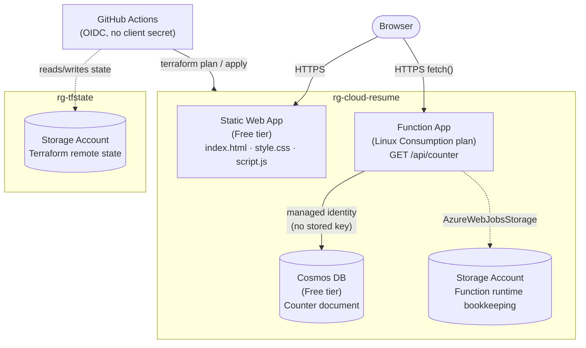

# Cloud Resume Challenge — Azure

A résumé website with a visitor counter, built to learn cloud infrastructure
and DevOps practices. Everything runs on Azure free tiers, is provisioned
with Terraform, and deploys via GitHub Actions.

**Live site:** https://nice-sky-01a7b960f.4.azurestaticapps.net

## Architecture



- **Resource Group (`rg-cloud-resume`)** — container for the app's resources. Deleting it tears down the whole app.
- **Static Web App** — hosts `index.html`/`style.css`/`script.js`. Free tier, no repository link (deployed manually via the SWA CLI and a deployment token, not GitHub-integrated builds).
- **Function App** — a single HTTP-triggered Node.js function (`GET /api/counter`) on a Consumption plan (pay-per-execution, scales to zero). Authenticates to Cosmos DB with a system-assigned managed identity — no connection string or key stored anywhere.
- **Cosmos DB (Free tier)** — one database, one container, one document holding the running visitor count. Only one free-tier Cosmos account is allowed per subscription.
- **Storage Account (`rg-tfstate`)** — holds Terraform's remote state, in a separate resource group so the app's lifecycle can never accidentally take out the state that describes it. Provisioned once by `terraform-state-storage/`, a small config with its own permanent local state (see that folder's comments for why).

## Repository structure

```
.
├── index.html, style.css, script.js   Phase 1 — the static site
├── terraform/                         Phase 2/3 — app infrastructure (remote state)
├── terraform-state-storage/           one-time bootstrap for the remote state backend
├── function/                          Phase 3 — the counter API (Node.js, Azure Functions v4 model)
└── .github/workflows/                 Phase 4 — CI/CD (plan on PR, apply on merge)
```

## CI/CD

Two workflows watch `terraform/**`:

- **`terraform-plan.yml`** — runs `terraform plan` on every pull request touching `terraform/`.
- **`terraform-apply.yml`** — runs `terraform apply -auto-approve` on every push to `master`.

Both authenticate to Azure via [OpenID Connect](https://learn.microsoft.com/azure/developer/github/connect-from-azure-openid-connect) (`azure/login`) against a dedicated Entra app registration with a federated credential trusting this exact repo — there is no Azure secret stored in GitHub at all. `AZURE_CLIENT_ID`, `AZURE_TENANT_ID`, and `AZURE_SUBSCRIPTION_ID` are stored as repository **variables**, not secrets, since they're identifiers rather than credentials.

Deploying the static site content and the function code isn't automated yet — both are pushed manually via their respective CLIs (see below). That's the natural next step beyond the current build phases.

## Local development / manual deploy

**Terraform** (from `terraform/`):
```bash
terraform init
terraform plan -out=tfplan
terraform apply "tfplan"
```

**Static site** (via the [Static Web Apps CLI](https://learn.microsoft.com/azure/static-web-apps/static-web-apps-cli-overview)) — deploy from a folder with *no* `.git` present (a known bug in the SWA CLI's cleanup step fails on git's read-only object files on Windows):
```bash
SWA_CLI_DEPLOYMENT_TOKEN=$(terraform -chdir=terraform output -raw static_web_app_api_key) \
  npx @azure/static-web-apps-cli@latest deploy <path-to-just-the-site-files> --env production
```

**Function code** (via [Azure Functions Core Tools](https://learn.microsoft.com/azure/azure-functions/functions-run-local)):
```bash
cd function
npm install
npx azure-functions-core-tools@4 azure functionapp publish func-cloud-resume-910aba --javascript
```

## Cost

Everything here runs on Azure free tiers or pay-per-use, consumption-based
pricing: Static Web App (Free), Cosmos DB (Free tier — 1000 RU/s + 25GB,
permanently free on one account per subscription), Function App (Consumption
plan — pay per execution, $0 at rest), and two Storage Accounts (a few KB–MB
of actual data, effectively fractions of a cent per month).
